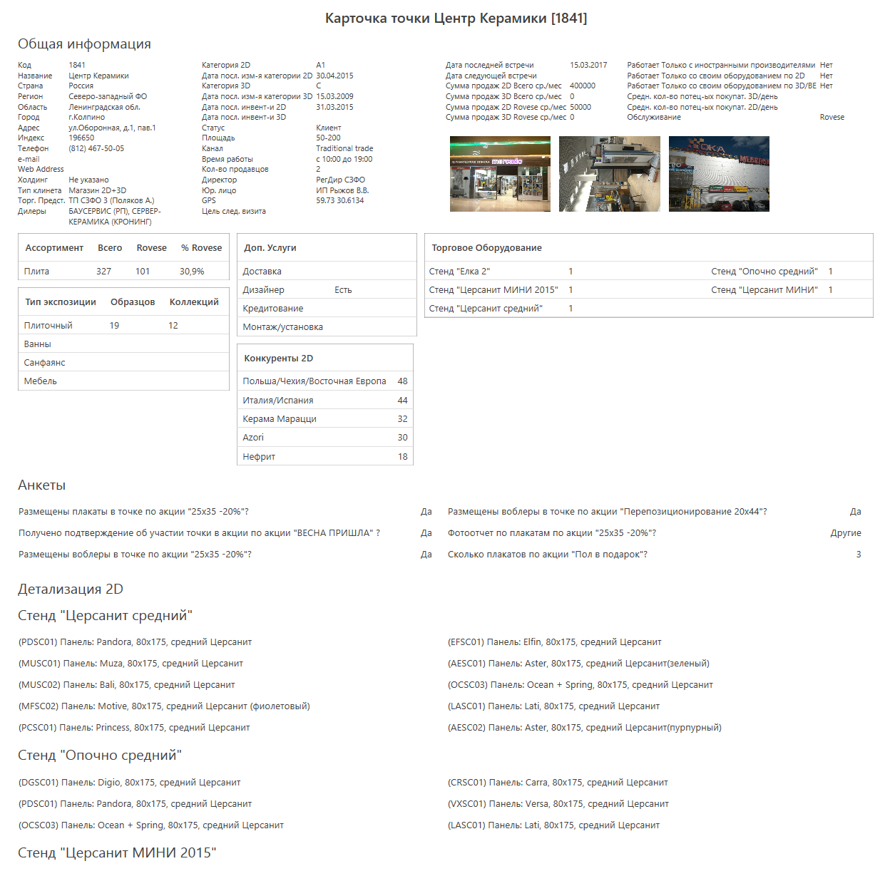
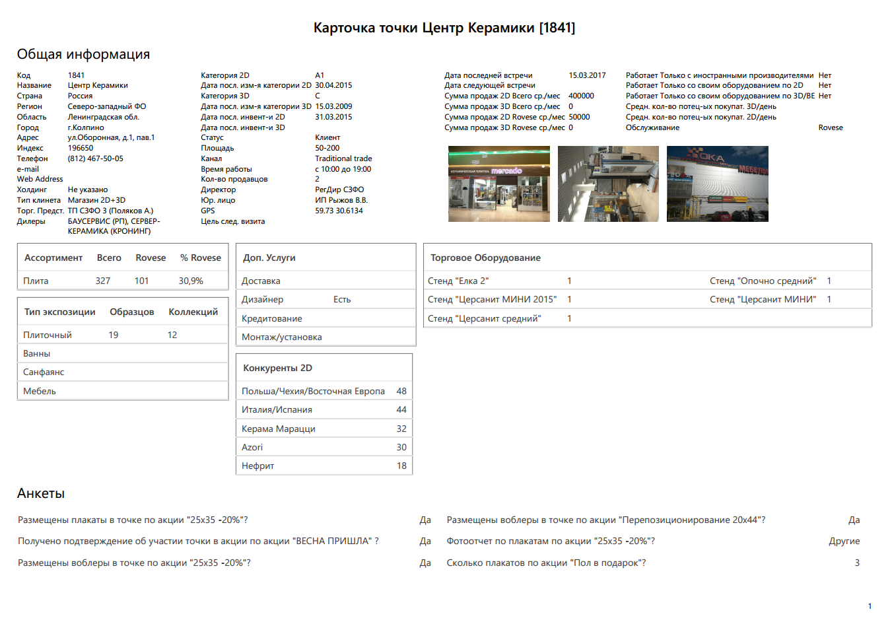
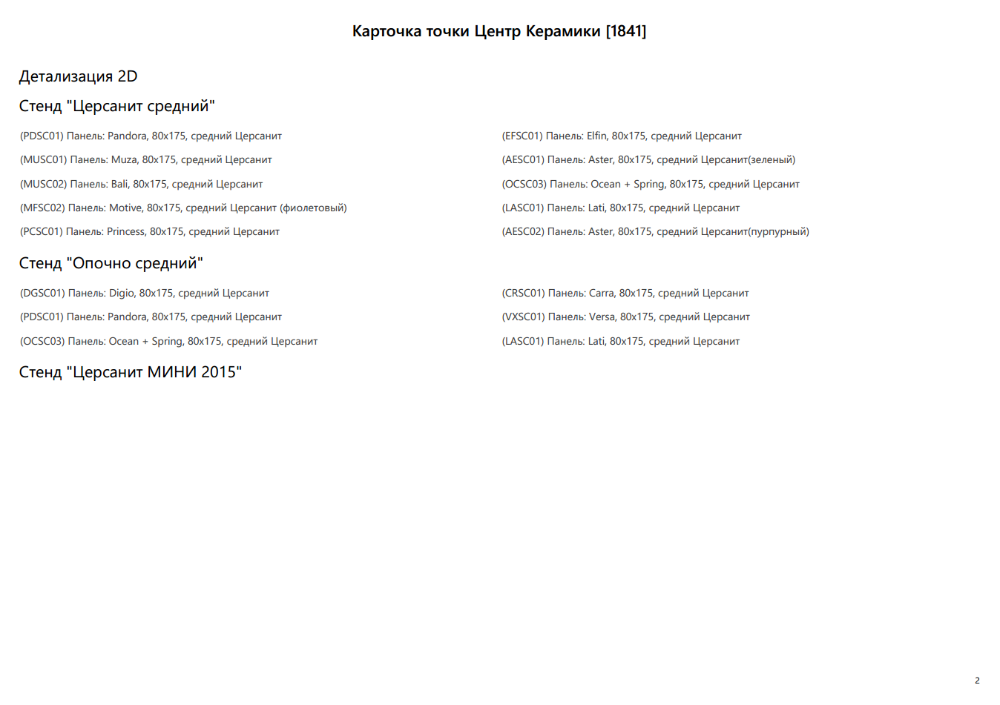

# SimpleWPFReporting

Reporting in WPF (XAML) made easy

## How to get it

SimpleWPFReporting package is available on [NuGet](https://www.nuget.org/packages/SimpleWPFReporting/)

You can use Package Manager Console to get it:

~~~powershell
PM> Install-Package SimpleWPFReporting
~~~

## How does it work

This project gives you the ability to create any report with the full power of WPF XAML. SimpleWPFReporting will take care of exporting it as a PDF or printing it. The important point is that SimpleWPFReporting will not rasterize your report before exporting or printing it.

In order to be able to divide any report into pages this project expects that you will use a vertical `StackPanel` as your report body. You should put your report elements into this `StackPanel`. SimpleWPFReporting accepts `StackPanel` as a parameter and automatically divides report elements into pages.

## How to use it

The main API of SimpleWPFReporting consists of `Report` static class, `ExportReportAsPdf` method, and `PrintReport` method. Both of the methods accept the same arguments.

### Required arguments

`StackPanel reportContainer` is your report body containing report elements.

`object dataContext` is the data context of your report.

`Thickness margin` is the margin applied to every report page. Both of the methods have overloads without the margin argument. They use `Thickness(25)` as a default margin.

`ReportOrientation orientation` is the orientation (`Portrait` or `Landscape`) of your report. 

### Optional arguments

`ResourceDictionary resourceDictionary` provides all the resources used in the report.

`Brush backgroundBrush` is the background brush of the report.

`DataTemplate reportHeaderDataTemplate` is the `DataTemplate` used to create a header for every page of the report.

`bool headerOnlyOnTheFirstPage` allows you to use a header only on the first page of the report. (default is false)

`DataTemplate reportFooterDataTemplate`  is the `DataTemplate` used to create a footer for every page of the report.

`bool footerStartsFromTheSecondPage` allows you to not use a footer on the first page of the report. (default is false)

### Page number

Every header and footer will be supplied with the `PageNumber` dynamic resource. You can use it as you wish. For example, this is the simplest possible footer DataTemplate:

```XML
<DataTemplate x:Key="ReportFooterDataTemplate">
    <TextBlock Text="{DynamicResource PageNumber}" HorizontalAlignment="Right"/>
</DataTemplate>
```

## Example

Report view:


Output PDF:



As you can see there is no difference between input (XAML) and output (PDF) except for paging. The subtle difference in the font weight and the width of the lines is due to artifacts of scaling of the screenshots. 
PDF is not rasterized, as you can see for yourself: [pdf](Files/output.pdf).
